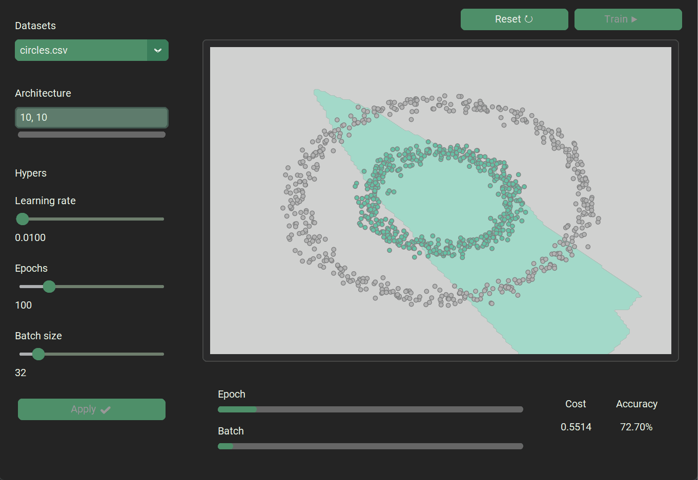

# 🕹️ HyperPlay

HyperPlay is an interactive GUI for exploring how hyperparameters affect a
simple neural network learning on 2D toy datasets. Adjust the settings and
watch the decision boundary update live.



## Why HyperPlay

This project started from curiosity about how different hyperparameters affect
the model in practice. How training unfolds is easiest to understand when you
can see it yourself. HyperPlay turns the usual “tweak, run, inspect” loop
into a live visual feedback loop so you can intuitively learn how learning rate,
batch size, and different architectures actually affect the training process.

## Quick Start

```bash
# clone this repo
git clone https://github.com/nick-ob/hyperplay
cd hyperplay

# install requirements
pip install -r requirements.txt

# run the app
python main.py
```

## How It Works

- Left panel stages changes to dataset, architecture, and hypers.
- Hit `Apply` to commit changes to the training setup.
- Hit `Train` to start learning and stream live snapshots to the plot.
- Reset reinitializes the network with the last applied settings.

## Features

- Live decision boundary visualisation for 2D datasets
- Custom fully connected neural network
(NumPy only, adapted from my [MNIST Neural Network from Scratch Project](https://github.com/nick-ob/mnist-numpy-nn)
- Background training thread for smooth UI updates
- Dataset loading from CSV files in `data/`
- Extensible GUI layout for hyperparameter controls

## Controls

- Dataset picker for built-in CSV datasets
- Architecture entry (comma-separated hidden layer sizes, e.g. `10, 10`)
- Learning rate slider
- Epochs slider
- Batch size slider
- Train / Reset / Apply actions

## Datasets

Datasets live in `data/` as CSV files. Each file contains columns for the input
features and a `y` label column.

Included datasets:

- `xor.csv`
- `spiral.csv`
- `moons.csv`
- `circles.csv`
- `blobs.csv`

## Project Structure

```text
hyperplay/
|-- main.py
|-- requirements.txt
|-- data/
|   |-- xor.csv
|   |-- spiral.csv
|   |-- moons.csv
|   |-- circles.csv
|   |-- blobs.csv
|-- assets/
|   |-- demo.gif
|-- src/
|   |-- gui.py                # GUI and training loop
|   |-- model.py              # Network class
|   |-- layer.py              # layer implementation
|   |-- activations.py        # ReLU / Softmax
|   |-- loss.py               # CCE loss + accuracy metric
|   |-- loading.py            # loads datasets from CSV
|   |-- types.py              # shared type for UI & Network
|   |-- theme/
|       |-- marsh.json         # UI theme
|       |-- icon.ico
```

## Tech Stack

- **Python**
- **NumPy** - math
- **CustomTkinter** - GUI
- **Matplotlib, Seaborn** - visualisations

## License

MIT — See [LICENSE](LICENSE)
